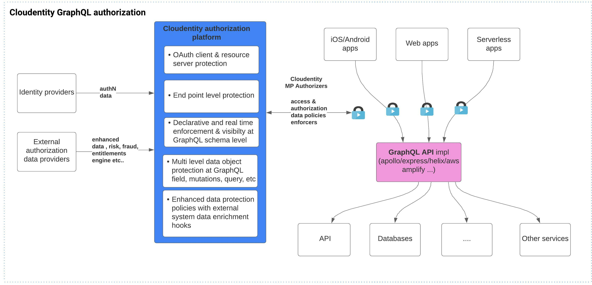
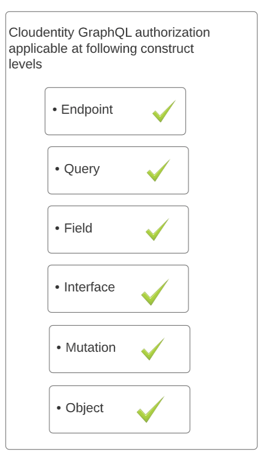
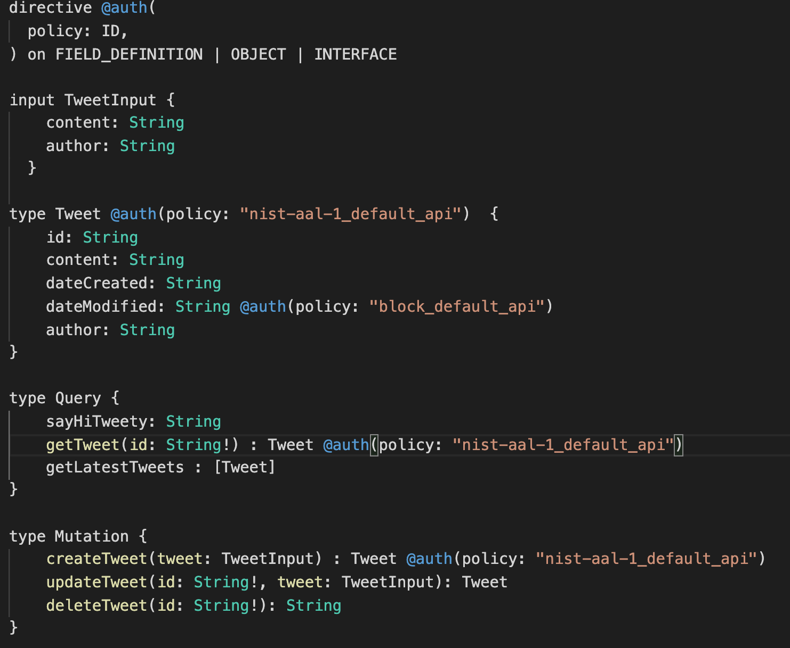

# Externalized authorization for GraphQL

This article is the first part of the article series to explore usage of Cloudentity authorization platform for externalized GraphQL runtime authorization along with policy based access controls for GraphQL native constructs. Modern applications require runtime and flexible authorization controls to manage the security and risk 
of data exposed using technologies like GraphQL to various consuming applications or users. 

* Part 1: Externalized authorization for GraphQL using Cloudentity authorization platform.
* Part 2: Build a GraphQL server with Nodejs and protect with Cloudentity authorization platform
* Part 3. Build a GraphQL client react application to consume GraphQL server resource and protect with Cloudentity authorization platform.

## Power of GraphQL

GraphQL is a query language for APIs and a runtime for fulfilling those queries with existing data objects. GraphQL uses a strong type system to define the capabilities of an API, the object types exposed in the API are defined in a schema using the GraphQL Schema Definition Language (SDL). The schema is a contract between client and server defining how a client can access the data. And it also defines the data structure that is agreed to be sent/requested over the network and this allows rapid independent development by frontend and backend developers as producers and consumers. GraphQL gives enormous power to clients to request required data over single hops and reduce network latency to drive better user experience using rich and related data elements.  

## Importance of data authorization

As GraphQL is gaining traction in the developer community, it is very essential to focus on the data that is getting exposed in the contract via the API’s, along with the governance, authorization and visibility into data access by numerous consuming applications. Along with this it is also imperative that the authorization is externalized and centrally managed and flexible enough at runtime and should be moved from the core business logic itself. As an owner of the data that is being shared via GraphQL endpoints, such a system owner should be able to monitor all data requests and apply sufficient authorization controls over requested data in a flexible manner, mainly in this era of very fast evolving data sharing specifications across various jurisdictions. 

The Cloudentity authorization platform provides a centralized, externalized and flexible way to provide authorization capability for business applications with all the required governance and real time visibility for data access protection for the GraphQL ecosystem. 

## How does Cloudentity authorization platform enable application teams?

Cloudentity authorization platform will enable 

* Application developers to eliminate embedding data authorization into GraphQL business logic
* Application developers to decouple hard to audit local enforcement rules and move them to a centralized location
* Application developers can manage, govern and enforce the externalized authorization rules independently of the application development
* Application to transitively support advanced data authorization requirements, including RBAC (Role based access control), ABAC (Attribute based access control) style models, without any modification to application code
* Applications to be readily complaint with emerging data standards like OpenBanking, OpenEnergy, OpenInsurance etc in terms of data sharing and privacy controls
* Application security engineers to have more visibility to platforms that are requesting data and enforce conditional policies to restrict based on conditions
* Applications to define and maintain all the authorization rules to be enforced as policies that will allow policy approval, review and other governance process 
* Application authorization policies to be defined in declarative format and can be propagate across environments using modern CI/CD and devops pipelines 
* Applications to utilize "Authorization as a service" offering either from Cloud or hybrid or on prem model

## GraphQL vs REST API authorization

A common question within developer community is “What is the difference between authorizing a GraphQL API vs REST API request?” GraphQL being a typed system facilitates us to introduce more tighter and stricter authorization mechanisms across the various GraphQL native constructs. Let us dive a bit deeper to understand this. 

GraphQL and REST both have the idea of a resource and resource identifiers associated with it. GraphQL exchanges data at a single endpoint whereas REST often involves several endpoints to gather data. This itself changes the authorization control paradigm of each request. With GraphQL a simple API endpoint protection cannot cover all the authorization requirements, it is essential to have more fine-grained control to authorize the data that is being requested depending on the query or mutation. 

In REST, the shape and size of the resource is determined by the server, so a lot of filtering and response manipulation happens at server end to evaluate fine grained decisions for data response. In contrast, in GraphQL the server declares what resources are available, and the client asks for what it needs at the time. GraphQL was exactly designed to limit this problem of overfetching. Overfetching brings extra data in each request which is not required by the client, and this increases the payload size and eventually that influences the overall response time of the query. Application developers can sometimes expose all data elements without thinking about the data security or sensitivity of the data fields. Since Graphql recommends a strict schema agreement, the authorization platforms can clearly see the requested data by client application, and the platform can authorize such requests even before it reaches the final endpoint that serves the business logic. Externalized field level GraphQL authorization offered by Cloudentity platform can enforce data attribute authorization policies in a granular way as to even distinguishing attribute release to different calling applications based on conditions defined in the policy. 

 In REST, the endpoint you call is the identity of that object. In GraphQL, the identity is separate from how you fetch the object. Underfetching is when one endpoint does not have enough data and multiple network calls slows down the process and affects the user experience. GraphQL design also allows to eliminate underfetching by aggregating data and return all data in single queries. This is efficient for bandwidth but can also easily expose a lot of data without the developers putting in too much thought about the sensitivity of information that is being aggregated and returned.  To be honest, application developers should be developing business logic and authorization should be treated as a cross cutting concern that is independent of the business logic. Again the externalized field and object level authorization can be applied to secure your business applications from exposing only authorized data to authorized applications.

 GraphQL system with a typed strict schema agreement provides us an opportunity to govern the data elements efficiently and systematically. The authorization of data exposed by GraphQL queries to each caller application is extremely critical. Cloudentity GraphQL authorization capabilities at object, field, interface, query, and mutation level are exactly built to secure the modern GraphQL applications and provide data attribute level authorization, classification, consent management and privacy management protection with ease and isolate it away from the core business rules and logic. 

## Cloudentity GraphQL authorization features

## GraphQL Native support

Cloudentity authorization concept for GraphQL is tailored around the native constructs of GraphQL and allows authorization at multiple levels around following building blocks

### Declarative authorization policies

 Cloudentity takes a declarative approach to authorization to allow externalized authorization that can seamlessly fit into modern deployment pipelines to easily adapt to varying data access requirements with fine grained control. Cloudentity authorization concept extends the usage of GraphQL directives to allow for authorization declaration. `@auth` directive is used to annotate the GraphQL query, mutation, fields, interfaces etc. at schema level to represent the authorization requirement. `@auth` directive just needs an auhtorization policy name, and the authorization policy can be authored, using [Rego] or [YAML] or Cloudentity policy editor and hosted within the Cloudentity authorization platform.

 
 
The authorization policy can be authored using data points that normally consist of: 
* Input HTTP request payload 
* HTTP request body 
    * URL 
    * Headers 
* Bearer token  
    * Key to identify the authorization context 
* Authentication context 
    * Identity and authentication context associated to the Bearer token principal 
* External data providers 
    * External systems that can be called to fetch more information and utilize in authorization decision process. For example, entitlement engines, risk engines etc. 

Once a policy is authored using above data elements, it can be attached to any of the GraphQL construct using the `@auth` directive in the GraphQL schema. 

### Modern CI/CD technology & devops friendly

 At Cloudentity, we facilitate modern application authorization and want to make sure our solutions to problems are also aligned with the devops practices within the organization. So, we always make sure we enable configuration as code and API first approaches to ease our platform integration into any modern CI/CD operational pipelines for ease of adoption by development, deployment, security, and operations teams. 

 Authorization policies can be attached to GraphQL constructs using 2 mechanisms 

 * Cloudentity GraphQL API explorer 

 Authorization policies are attached via the Cloudentity GraphQL API explorer screen to GraphQL constructs loaded from the GraphQL schema; once attached the modified schema with directives can be exported for source control using JSON/YAML formats and propagated to higher environments. The exported file is a decorated GraphQL schema with `@auth` directives. This allows rapid development, source control and deployment of verified authorization policies to environments through modern deployment pipelines. 

 * GraphQL Schema Annotation 

 Development teams can also consider bottom-up approach to annotate the schema directly and bypassing the Cloudentity GraphQL API explorer screen. Cloudentity platform will automatically detect such directives within the schema and then display accordingly in the API explorer. 

 

 Irrespective of the way the contruct is attached, the annotated schema can be exported to allow fine grained policy administration pipleines within the team and across the environments which can include the following
    * policy creation
    * policy updation
    * Policy approval
    * policy evaluation
    * policy storage as code
    * policy deployments using devops pipelines

### Externalized Authorization Runtime enforcement

Cloudentity authorization platform utilizes open standards and uses the OAuth specification as the basis for authorization and access to resources. Adhering to the OAuth specification, GraphQL implementation is considered as an OAuth Resource server, and it can be protected as such in Cloudentity authorization platform. So, applications (mobile apps, terminal apps, web apps etc.) acting as OAuth client application need to first obtain an access Token from the Cloudentity Authorization server. Also note that Cloudentity also supports access Tokens from other Authorization servers, Cloudentity will internally exchange for its own access Token at the edge level without the application making any change. 

Cloudentity authorization platform securely and automatically distributes the policy rule to all the runtime enforcement components, regularly referred as policy decision points. Cloudentity offers various enforcers in form or sidecars, plugins, lambda etc. based on deployment platform to enforce runtime access protection. Cloudentity enforcement points, also known as Micro Perimeter authorizers, are available for most of the widely adopted application deployment patterns and can be seamlessly plugged into deployment architectures to enforce authorization decisions. Some of the widely used authorizers are 

* Istio authorizers for Kubernetes 
* Cloudentity authorizers for commonly used API gateways AWS API Gateway, Azure APIM , Google APIGEE X, APIGEE Edge, Kong etc. 
* Standalone authorizers for platform independent containerzed/non-containerized workloads 
* Lambda authorizers for supported Cloud platforms

## GraphQL application protection demo

We will dive deeper in next articles to go through some use cases to get an overview of Cloudentity authorization concept applied to a GraphQL API subsystem. 
For illustrative purposes, we will build a tweet service and a front end application in this series powered using GraphQL API server and a client. The main intent is to highlight various authorization decisions points that could be externalized and how Cloudentity platform enables externalized policy enforcements for a more flexible development journey. Please note that the language chosen for development of sample application is just for illustration purpose. 

 For developer community, the initial thought would be to embed the authorization requirements into the business logic, but this is not beneficial in long run and such an approach will black box authorization within business logic, making it hard to refactor and will have no visibility in terms of enforcement and data access across various calling applications. Our goal is to enable developers to move away from black boxing authorizations within business logic code, so that the data authorization and access rules is externalized and have more visibility and can be approved, modified and distributed to various enforcement points without code refactor. 

Some of the authorization scenarios we will exploring in further articles are:
* Automatically block entire access to the API's at runtime
* Authorizing data access based on IP address of the request
* Enforce users to have at least have assurance level of NIST AAL 1(Authenticator Assurance Level) to interact with particular GraphQL queries
* Enforce users to have at least have assurance level of NIST AAL 2(Authenticator Assurance Level) to interact with particular GraphQL mutations
* Enforce specific authorization for specific data fields
* Enforce authorization for requests with specific types

