# Build and secure a GraphQL based application with Cloudentity authorization platform

This article is part 2 of our GraphQL application protection series. In this article, we will build a GraphQL API
server and protect its resources with externalized policies administered in Cloudentity Authorization SaaS platform.
We will also protect the GraphQL API endpoint data with a local policy enforcement/decision point for the app deployed
within a local Kubernetes cluster. This approach also will showcase a
modern application protection hybrid model with local enforcement and Cloud based authorization and policy administration.

* Part 1: Externalized authorization for GraphQL using the Cloudentity authorization platform
* Part 2: Build a GraphQL server with Node.js and protect with the Cloudentity authorization platform
* Part 3. Build a GraphQL client react application to consume GraphQL server resources protected with the Cloudentity authorization platform

## Overview

We will build the graphQL API server with `express-graphql` and `lokijs` as a built in database.
Our application would be a tweet service that serves and consumes data exposed through APIs as
per GraphQL specification. Once we build the application, we will deploy it to a local
kubernetes cluster using `kind` and enforce centralized and decoupled policy based authorization without
modifying any business logic or code.

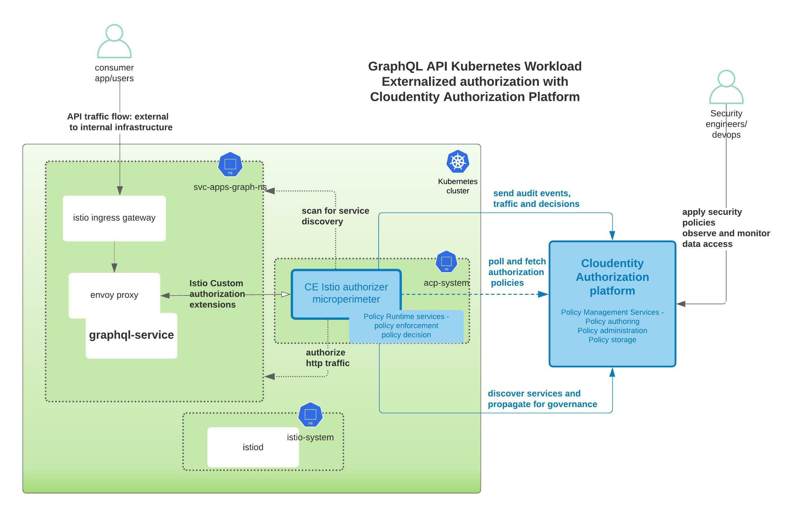

You can checkout this entire [demo application and related integration source here](https://github.com/cloudentity/ce-samples-graphql-demo)

## Build the GraphQL server application

### Pre-requisites

Following tools are required to build this application. `nodejs` was picked for its simplicity to build apps.

- [nodejs](https://nodejs.org/en/) - Recommended v16.0 +
- [npm](https://docs.npmjs.com/getting-started) - Recommended v8.3.0 +

---
**SKIP/JUMP LEVEL**

> In case you are not interested in building the application from scratch, you can skip some of the steps below and instead checkout/clone the
> [github repo to get the application source code](https://github.com/cloudentity/ce-samples-graphql-demo)
> ```bash
> git clone git@github.com:cloudentity/ce-samples-graphql-demo.git
> ```
> and follow instructions to continue with the [Build and Deploy Section](#deploy-and-run-graphql-api-workload-in-kubernetes-cluster)
>
---

### Initialize a Node.js project

Initialize a Node.js project.

```bash
mkdir tweet-service-graphql-nodejs && cd tweet-service-graphql-nodejs
npm init
```

Click enter with no input for all prompts during npm init and finally type `yes` for the OK prompt. This will create
a `package.json` for the project that will eventually hold dependencies and other execution script commands.

Add a `start` command to scripts section in `package.json` to start the app quickly, e.g.:

```json
{
..
  "scripts": {
    "test": "echo \"Error: no test specified\" && exit 1",
    "start": "node index.js"
  },
  ..
}

```

We will use `express` npm module for http handling, so let's install the dependency as well.

```bash
npm install --save express
```

### Add http routers and listeners

Create a file named `index.js` and add basic router and listeners.


```js
var express = require('express');
var app = express();

app.get('/', function(req, res) {
	res.send("We are building a tweet service!")
});

app.get('/health', function(req, res) {
	res.send('Service is alive and healthy')
});

app.listen(5001);
console.log("Server listening at http://localhost:5001/");

```

### Run the app

```bash
npm start
```

This will start and serve the Node.js app listener, and the endpoints below should be serving traffic:

* [http://localhost:5001](http://localhost:5001)
* [http://localhost:5001/health](http://localhost:5001/health)


Now that we have the basic structure in place, let's continue to add some GraphQL specific features to the Node.js application.

### Add GraphQL capabilites

To add GraphQL API compliant endpoint within the Node.js server application, we will use the `express-graphql` npm package.
Let's install the dependencies and attach a listener endpoint for graphQL.

```bash
npm install --save graphql express-graphql
```

**GraphQL SDL** allows defintion of the GraphQL schema using various constructs as
defined in the [GraphQL specification](https://spec.graphql.org/June2018/#sec-Schema). Let's build a schema that has a mixed
flavor of basic object types, fields, query and mutations.

In the schema, we will add a mix of GraphQL constructs and later in the article we will explore how to attach externalized authorization policies to each of these GraphQL constructs.

| GraphQL Construct | Examples |
| --- | ----------- |
| Object Type | TweetInput, Tweet |
| Field | content, author, id, dateModified, dateCreated .. |
| Query | sayHiTweety, getTweet, getLatestTweets .. |
| Mutation | createTweet, updateTweet, deleteTweet .. |

Add below schema specification to `index.js`

```js
// graphql package import
var { graphqlHTTP } = require('express-graphql');
var { buildSchema } = require('graphql');

// graphql schema definition
var schema = buildSchema(
	`
	input TweetInput {
		content: String
		author: String
	  }

	type Tweet {
		id: String
		content: String
		dateCreated: String
    dateModified: String
		author: String
	}

	type Query {
		sayHiTweety: String
		getTweet(id: String!) : Tweet
		getLatestTweets : [Tweet]
	}

	type Mutation {
		createTweet(tweet: TweetInput): Tweet
		updateTweet(id: String!, tweet: TweetInput): Tweet
    deleteTweet(id: String!): String
	}`
);
```

* **Add implementation & listener for a GraphQL query**

Let's add a simple resolver implementation for the first query `sayHiTweety`. We will expand to other query and mutation implementations
later in the article. In contrast to REST, GrpahQL is designed to be a single endpoint API system. So all the queries and mutations will
be served over this single enpoint at `/graphql`. The url name can be anything, `graphql` is just used for convenience.

```js

var resolverRoot = {
	sayHiTweety: () => {
	return 'Hello Tweety';
    }
};

app.use('/graphql', graphqlHTTP(
{
	schema: schema,
	rootValue: resolverRoot,
	graphiql: true

}
));

```

* **Verify GraphQL API operations**

Start the application using `npm start` and launch the graphQL endpoint at [http://localhost:5001/graphql](http://localhost:5001/graphql).
Since the `graphiql` flag is set to true, we will see an interactive query screen and schema explorer as response.

---
**NOTE**

We will not be using above interface but usage of [Postman](https://www.postman.com/downloads/) app for further verification of GraphQL APIs
is recommended.

---

[Download Postman](https://www.postman.com/downloads/) app, in case you don't have it already, and then [import](https://learning.postman.com/docs/getting-started/importing-and-exporting-data/#importing-data-into-postman) the [Cloudentity GraphQL tweet service demo postman collection](https://www.getpostman.com/collections/b84dcc2e6d7034c02d48) onto Postman.


* **Execute GraphQL `sayHiTweety` query**

Navigate to the [imported postman collection](https://www.getpostman.com/collections/b84dcc2e6d7034c02d48) under `request-noauth` folder and run the `sayHiTweety-Query` GraphQL API request.
It should respond with the response attached below.


### Expand GraphQL implementation logic

Let's add a simple in-memory datastore to store the tweets and then add some mutations and queries to act on those objects.
We are will not dive into the specifics and also not add any complex business logic. Our main goal is to showcase **externalized
authorization policy administration and enforcement** for the various **GraphQL objects, fields, queries and mutations etc at runtime**.

* Install dependencies

```bash
npm install --save uuid lokijs
```

* Add implementation for GraphQL query and mutation

```js
//imports
var loki = require('lokijs');
const {v4: uuidv4} = require('uuid');

//logic
var db = new loki('tweets.db');
var tweets = db.addCollection('tweets');

const getTweet = (tid) => {
	console.log("Fetching record..");
	var results = tweets.find({id: tid.id});
	var res = results.length > 0 ? results[0] : null
	return res;
}

const storeTweet = (t) => {
	tweets.insert(
		{
			id: t.id,
			content: t.content,
			author: t.author,
			dateCreated: t.dateCreated
		}
	);
	console.log(tweets);
	return t;
}

function Tweet(input) {
	this.id = uuidv4();
	this.content = input.tweet.content;
	this.author = input.tweet.author;
	this.dateCreated = new Date().toLocaleString();
	this.dateModified = new Date().toLocaleString();
}

var resolverRoot = {
	sayHiTweety: () => {
	    return 'Hello Tweety';
    },
    getTweet: (tid) =>  {
		console.log("Fetching tweet using id: " + Object.values(tid));
		return getTweet(tid);
	},
	createTweet: (input) =>  {
		console.log("Creating a new tweet...");
		const newTweet = new Tweet(input);
		storeTweet(newTweet);
		return newTweet;
	},
	getLatestTweets: () => {
		console.log("Fetching records..");
		var tweets = db.getCollection('tweets');
		var all = tweets.find({ 'id': { '$ne': null } });
		return all;
	},
	deleteTweet: (tid) => {
		console.log("Deleting tweet..");
		var tweets = db.getCollection('tweets');
		tweets.findAndRemove({id: tid.id});
		return tid.id;
	},
};

```

* **Verify all GraphQL API operations**

Navigate to the imported collection in Postman and run rest of the GraphQL endpoints. These
should now return responses similar to below attached samples. At this point the GraphQL API application is **completely unprotected** and data can be requested or posted without authorization.

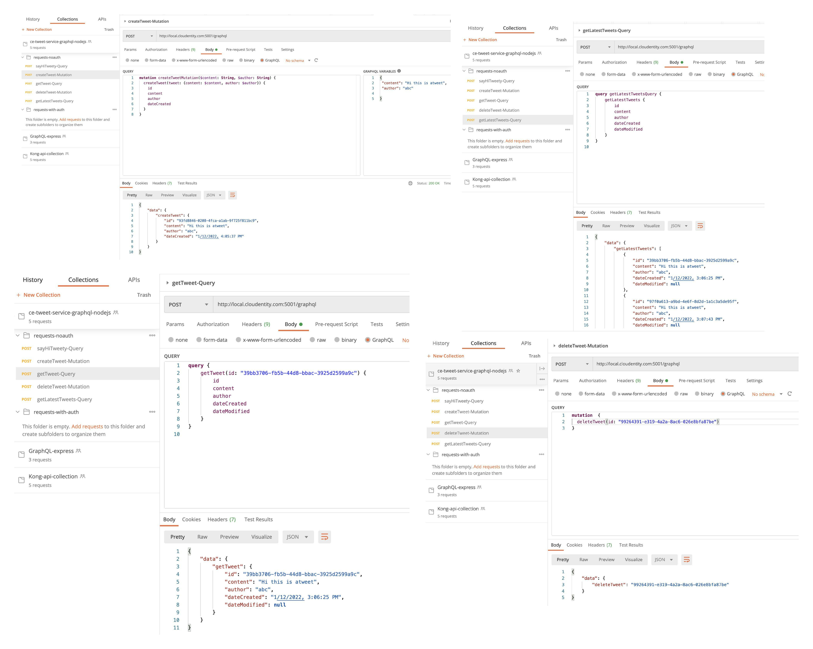


### Deploy and Run GraphQL API workload in Kubernetes cluster

Let's deploy the GraphQL API onto a local Kubernetes cluster to enforce **externalized
authorization policies with the Cloudentity authorization platform** without any modification to the application code.

---
**NOTE**

> We will be referencing `make` commands in below sections. There is a [`Makefile`](https://github.com/cloudentity/ce-samples-graphql-demo/blob/master/tweet-service-graphql-nodejs/Makefile) in the project folder and
> the contents can be inspected for the actual commands that is orchestrated by the `make` target

---

### Pre-requisites

Local Kubernetes cluster
can be deployed using any tool of your choice, but we will use `kind` in this article.

* [docker](https://docs.docker.com/get-docker/)
* [kind](https://kind.sigs.k8s.io/docs/user/quick-start/#installation)
* [helm](https://helm.sh/docs/helm/helm_install/)
* [kubectl](https://kubernetes.io/docs/tasks/tools/)

---
**SKIP/JUMP LEVEL**

> In case you want to skip some of the deployment detailed steps and want to move to next logical step with a shortcut, use
>```bash
> make all
> ```
>
> This will deploy all resources and you can jump to the [Protect using Cloudentity authorization platform](#authorization-policy-administration-in-cloudentity-authorization-platform)

---

### Build the docker image

Let's build the docker image for GraphQL API using `make build-image`

### Launch the Kubernetes cluster

We will create a Kubernetes cluster using `kind`. Below cluster config will be used to
create the cluster and within the config, a `NodePort` is configured to enable accessibility
at port `5001` from outside of the cluster since we do not have an actual load balancer.

`k8s-cluster-config.yaml`

```yaml
kind: Cluster
apiVersion: kind.x-k8s.io/v1alpha4
nodes:
- role: control-plane
  extraPortMappings:
  - containerPort: 31234
    hostPort: 5001
    protocol: TCP
```

Let's launch the kind cluster using below command:

`make deploy-cluster`

### Deploy GraphQL app on the Kubernetes cluster

We will use `helm` to define and deploy all the Kubernetes resources required for the application. We will not be going into the helm details, but [you can find all the helm templates already in the repo].

Using below `make` command, we will upload the image to kind cluster, create a Kubernetes namespace and deploy the GraphQL app.

```bash
make deploy-app-graph-ns
```

Above make target will launch all the pods and services to run the GraphQL app. The status of the pods and services can be fetched using:

```bash
kubectl get pods -n svc-apps-graph-ns
kubectl get services -n svc-apps-graph-ns
```

### Service readiness

Let's exec into the pod container to see if the service is reachable (note the ID appended to the name of the pod after running `kubectl get pods -n svc-apps-graph-ns` and replace it in the command below)

```bash
kubectl exec -it <pod-name> /bin/sh -n svc-apps-graph-ns
```

and run

```bash
curl --location --request POST 'http://local.cloudentity.com:5001/graphql' \
--header 'Content-Type: application/json' \
--data-raw '{"query":"query {\n    sayHiTweety\n}\n","variables":{}}'
```

```json
{
    "data": {
        "sayHiTweety": "Hello Tweety"
    }
}
```
---
**NETWORK ACCESS**

The components deployed on the Kubernetes cluster are not exposed outside the Kubernetes cluster. External access to individual services can be provided by creating an external load balancer or node port on each service. An Ingress Gateway resource can be created to allow external requests through the Istio Ingress Gateway to the backing services.

---

### Deploy Istio

To allow external service access, let's install `Istio` onto this cluster. We will use the [`helm` based install mechanism for installing `istio`](https://istio.io/latest/docs/setup/install/helm/)
We have condensed all required steps under the `make` target, which updates the helm repo and installs `istiod` under `istio-system` namespace.

```bash
make deploy-istio
```

Check the status of the pods using `kubectl get pods -n istio-system` and once the pod is healthy, let's add an Istio Ingress Gateway to expose the traffic outside the cluster

### Expose the Service externally with Istio Ingress Gateway

Let's install the `Istio Ingress Gateway` and configure a `Virtual Service` for routing to the GraphQL service in the `svc-apps-graph-ns` namespace using:

```bash
make deploy-istio-gateway
```

You can confirm if the gateway and virtual service is created and running using

```bash
kubectl get gateways -A
kubectl get virtualservices -A
```

Now let's check to see if we can access the service from outside the cluster

```bash
curl --location --request POST 'http://localhost:5001/graphql' \
--header 'Host: local.cloudentity.com' --header 'Content-Type: application/json' \
--data-raw '{"query":"query {\n    sayHiTweety\n}\n","variables":{}}'
```

OR

```bash
curl --location --request POST 'http://local.cloudentity.com:5001/graphql' \
--header 'Content-Type: application/json' \
--data-raw '{"query":"query {\n    sayHiTweety\n}\n","variables":{}}'
```

Notice that the either the `Host` header needs to be passed in or the domain
needs to have a matching name of `local.cloudentity.com` as its defined in the `iStio Virtual
Service` routing rule.

Expected output.

```json
{
    "data": {
        "sayHiTweety": "Hello Tweety"
    }
}
```

Voila! Now the services should be accessible from outside the cluster. Now that we have a production-like Kubernetes deployment serving GraphQL operations from the platform, let's dive into protecting the application using **externalized authorization policies using the Cloudentity platform** without altering the application code at all.

## Authorization Policy administration in Cloudentity authorization platform

* Sign up for a [free Cloudentity Authorization SaaS account](https://authz.cloudentity.io/register)
* Activate the tenant and take the self guided tour to familiarize with the platform

Now that you have Cloudentity platform available, let's connect all the pieces together
as shown in this diagram

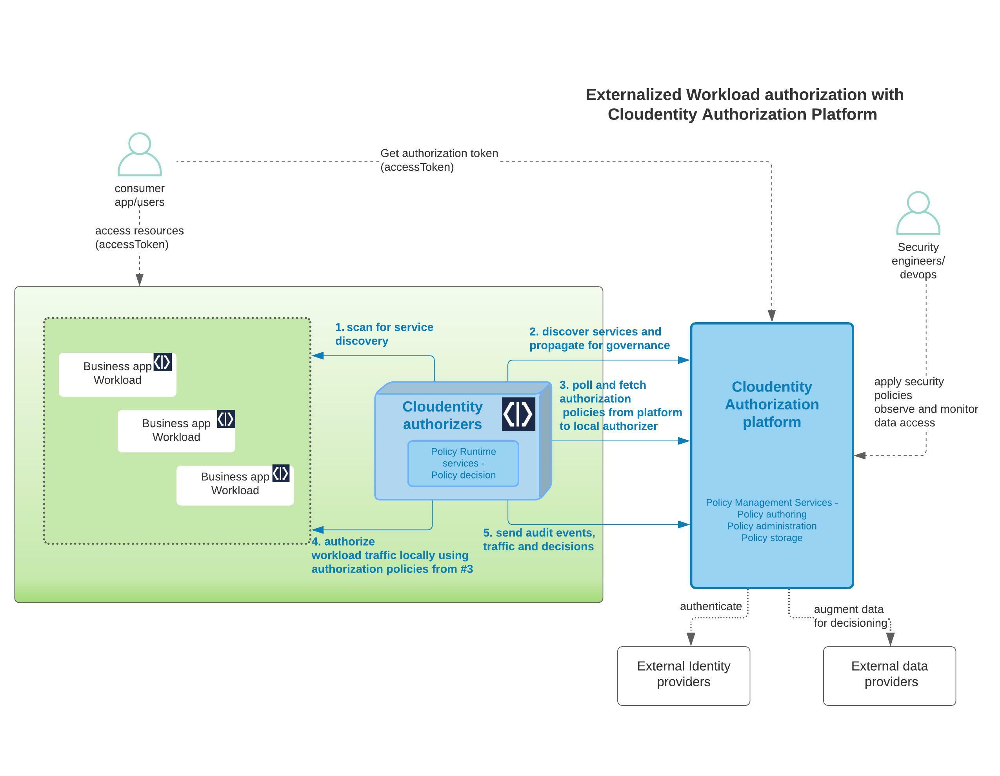

### Annotate services for service auto discovery

Cloudentity micropermeter authorizers can self discover API endpoints if annotated properly in a Kubernetes cluster. More details on discovery is detailed in [auto discovery of services on Istio](https://docs.authorization.cloudentity.com/guides/developer/protect/istio/graphql/#graphql-api-discovery).

For example, [in the helm chart](https://github.com/cloudentity/ce-samples-graphql-demo/blob/master/tweet-service-graphql-nodejs/helm-chart/tweet-service-graphql-nodejs/templates/deployment.yaml#L8), we have annotated the services so that final Deployment resource file has the annotations. `services.k8s.cloudentity.com/spec-url` annotation enables this GraphQL schema to be read by
Cloudentity Istio authorizers deployed onto a cluster and then propagated to Cloudentity Authorization Plaform which can then govern and
attach declarative policies on the GraphQL schema itself.

---
**NOTE**

The GraphQL schema URL can be served by the GraphQL API resource server itself or hosted in separate accessible location, we are using
an external url only for demonstration purpose

---


```yaml
apiVersion: apps/v1
kind: Deployment
metadata:
  name: {{ include "tweet-service-graphql-nodejs.fullname" . }}
  labels:
    {{- include "tweet-service-graphql-nodejs.labels" . | nindent 4 }}
  annotations:
    services.k8s.cloudentity.com/spec-url: "https://raw.githubusercontent.com/cloudentity/random-bin/master/graphql/tweet-svc-schema"
    services.k8s.cloudentity.com/graphql-path: "/graphql"
```


In case you want to change the annotation, you can [update the url in the helm template](https://github.com/cloudentity/ce-samples-graphql-demo/blob/master/tweet-service-graphql-nodejs/helm-chart/tweet-service-graphql-nodejs/templates/deployment.yaml#L8) and do the following

```bash
helm uninstall svc-apps-graphql -n svc-apps-graph-ns
helm install svc-apps-graphql helm-chart/tweet-service-graphql-nodejs -n svc-apps-graph-ns
```

### Download Cloudentity Istio authorizer (Policy decision authorizer)

In this step, we will download and configure the Cloudentity Istio authorizer to act as the Policy Decision Point(PDP). The scope of responsibility of this component is to act as the local policy decision point within the Kubernetes cluster. This component is also responsible to pull down all the applicable authorization policies authored and managed within the remote the Cloudentity authorization platform. In the below image, the highlighted section in the box is the component that we will download and install onto a local Kubernetes cluster.


[Detailed Istio setup concepts and instruction are available here,](https://docs.authorization.cloudentity.com/guides/developer/protect/istio/) in a nutshell the steps are:
* Navigate to Cloudentity authorization platform admin console
* Go to `Enforcement >> Authorizers` and Create a new Istio authorizer
* Navigate to next tab and `Download package` to get all the required Kubernetes manifest files.

### Deploy Istio authorizer to the Kubernetes cluster

We will use the above downloaded package to deploy the Istio authorizer. Unzip the package and you will find various k8s resources that is required to deploy the Istio authorizer service onto the local Kubernetes cluster along with the communication secrets for the Cloudentity authorization platform.
* `manifest.yaml`
* `kustomization.yaml`
* `parse-body.yaml`

---
**NOTE**

Cloudentity Istio authorizer will be deployed to its own name space (in this case `acp-system`). The authorizers can be deployed to any namespace
based on the deployment architecture. The namespaces chosen in this article are for demonstration purpose only.

---


---
**IMPORTANT**

The `manifest` file from the download package contains configuration to scan only the `default` namespace for services. In this case, the services are in a different namespace (i.e `svc-apps-graph-ns`) and hence we need to add the namespace onto the args to specify the namespace the `istio-authorizer` should scan to discover and protect the service, and then push that information back up to the Cloudentity authorization platform. Let's modify the downloaded `manifest.yaml` to include the namespace args. Find the portion of the config block below, and insert the `args` param as shown below at the end of the snippet:

Cloudentity Istio authorizer that will be deployed to its own name space (in this case `acp-system`)

---

Let's modify the downloaded `manifest.yaml` to include `DISCOVERY_NAMESPACES` environment variable. Below provided block is just a snippet, so edit the downloaded file
in place and add only the `DISCOVERY_NAMESPACES` argument to the list of `env` variables:

```yaml
apiVersion: apps/v1
kind: Deployment
metadata:
  labels:
    app: istio-authorizer
  namespace: acp-system
  name: istio-authorizer
spec:
  replicas: 1
  selector:
    matchLabels:
      app: istio-authorizer
  template:
    metadata:
      labels:
        app: istio-authorizer
      name: istio-authorizer
    spec:
      serviceAccountName: istio-authorizer
      containers:
        - image: docker.cloudentity.io/istio-authorizer:2.0.0-9
          imagePullPolicy: IfNotPresent
          name: istio-authorizer
          env:
          - name: "DISCOVERY_NAMESPACES"
            value: "svc-apps-graph-ns"
...
...
```

We are now ready to install the `istio-authorizer` resources using the Kubernetes kustomization file in the downloaded package. Make sure that you are running this command
from the the downloaded folder location or wherever you may have moved it.

```bash
kubectl apply -k .
```

Above command will create a new `acp-system` namespace and deploy the `istio-authorizer` under that namespace. Watch for the pod status (`kubectl get pods -n acp-system`) to make sure the `istio-authorizer` comes up clean and healthy.

Let's also add a request body parser sidecar for the service pod, without this the Cloudentity authorizer sidecar will not be able to parse the GraphQL request body.

---
**IMPORTANT**

Above `parse-body.yaml` file from download package contains configuration for the `default` namespace. In this case, the services are in a different namespace (i.e `svc-apps-graph-ns`) and hence we need to add the namespace onto the args to specific the namespace where this envoy filter sidecar needs to be attached

---

```yaml
apiVersion: networking.istio.io/v1alpha3
kind: EnvoyFilter
metadata:
  name: acp-authorizer-with-body
  namespace: svc-apps-graph-ns
spec:
  configPatches:
  - applyTo: HTTP_FILTER
    match:
      context: ANY
      listener:
        filterChain:
          filter:
            name: "envoy.filters.network.http_connection_manager"
            subFilter:
              name: "envoy.filters.http.ext_authz"
    patch:
      operation: MERGE
      value:
        name: envoy.filters.http.ext_authz
        typed_config:
          "@type": type.googleapis.com/envoy.extensions.filters.http.ext_authz.v3.ExtAuthz
          with_request_body:
            max_request_bytes: 8192
            allow_partial_message: true
            pack_as_bytes: true

```

Once it is updated, let's apply the k8s resource

```bash
kubectl apply -f parse-body.yaml
```

> NOTE
> If you don't apply the above request parser sidecar, you will get this error
>
> ```json
> {
    "errors": [
        {
            "message": "failed to parse json: unexpected end of JSON input"
        }
    ]
}
>```


```bash
kubectl get pods -n acp-system
```

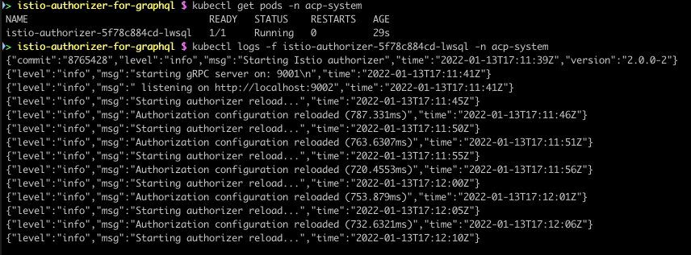

---
**IMPORTANT**

We have seen issues with this step if there is network traffic restrictions between the local workstations and the external Cloudentity platform due to internal firewalls etc.
Make sure the traffic path is allowed in case you see the pod status as not healthy.

---

After this step we should see the APIs auto discovered by the Cloudentity authorizer and propagated back up to the the Cloudentity Authorization SaaS platform. Let's check it out in the Cloudentity authorization platform.

### **Cloudentity authorizer and Cloudentity platform communication**

It is very important that the communication path between the local Istio authorizer and Cloudentity Authorization SaaS platform is established. The local istio authorizer is
responsible for pushing any discovered services to platform for further governance. Once pushed, the centralized policies administered and managed in the platform
are polled back by the authorizer for policy decisions and enforcement locally.


Login into the Cloudentity authorization admin portal and Navigate to the `Enforcement >> Authorizers`. As shown in the below diagram, the `Last Active` column is an indication of communication status of the local authorizer with the remote platform


Regarding the communication security, the local Istio authorizer uses `OAuth` authorization mechanisms to authenticate itself to the Cloudentity authorization SaaS platform before handshaking information.

* **Bind the discovered service**

Our next step is the process of binding the discovered services. Technically this means, we will register this discovered service as an `OAuth resource server` within
the Cloudentity platform. If you had checked the box to autobind services while registering the Gateway, you can skip this step.

Let's click on the services under `APIs` tab within the `Gateway` and click `Connect`. It will prompt to create a service (aka `OAuth resource server`). We can later attach scopes to service but for now we will just create a service and connect to it.


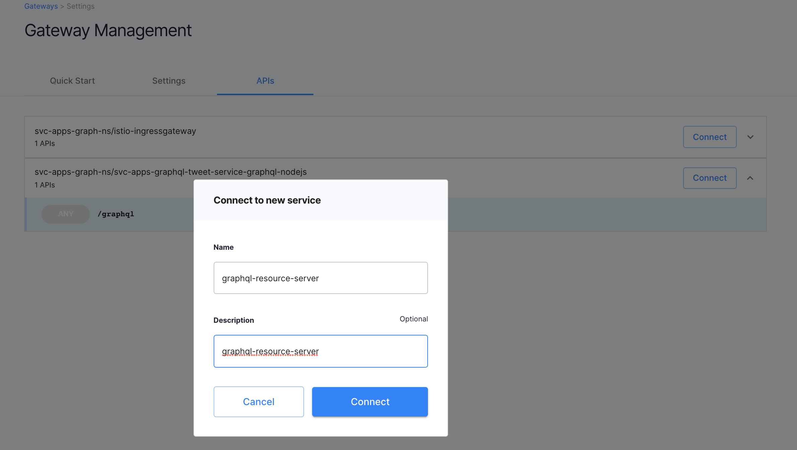

* **Explore GraphQL API and Schema**

Now that the service is created within the Cloudentity authorization platform, we can govern the service endpoints. The discovered GraphQL schema transferred by the local Cloudentity authorizer is now visible in the platform for applying policies and managing the policies applied to the various constructs within that GraphQL schema.

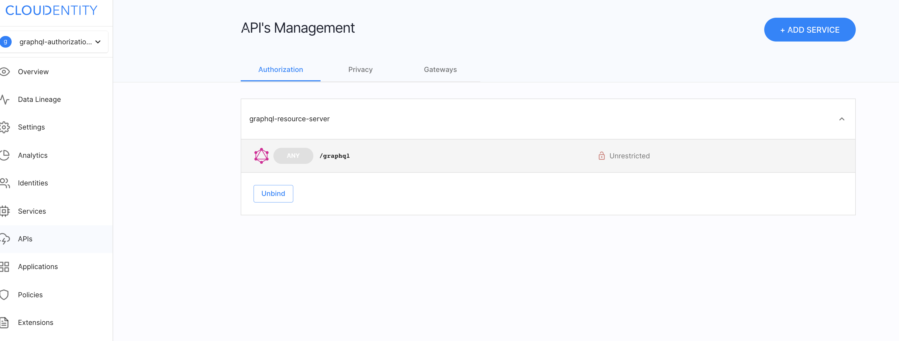

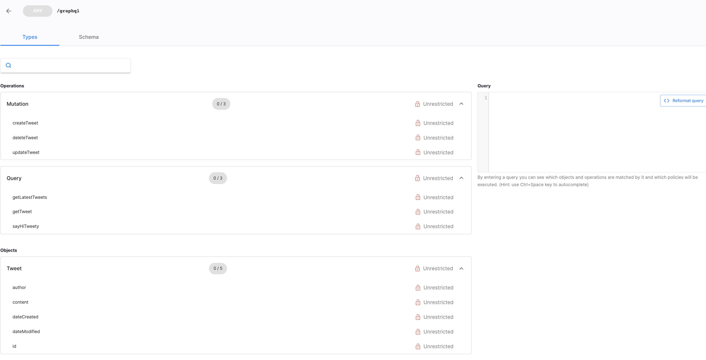


Now that we have seen the service is available in the Cloudentity authorization platform for governance and central management of authorization policies, which will automatically be
downloaded by respective local satelite Cloudentity authorizers bound to the services. This way Cloudentity authorization platform acts as a very powerful and robust Policy Management Services engine and the Cloudentity authorizers acts as Policy runtime services that makes decisions using the policies governed and administered within the central Policy management engine.

Let's move back to the local Cloudentity authorizer to enforce traffic protection.


### Attach Cloudentity authorizer as Istio external authorization provider

Cloudentity Istio authorizer is designed to be a native Istio extension that uses [Istio External authorizer](https://istio.io/latest/docs/tasks/security/authorization/authz-custom/) model.

Let's enable the Istio extension provider to accept Cloudentity Istio authorizer as an extension.

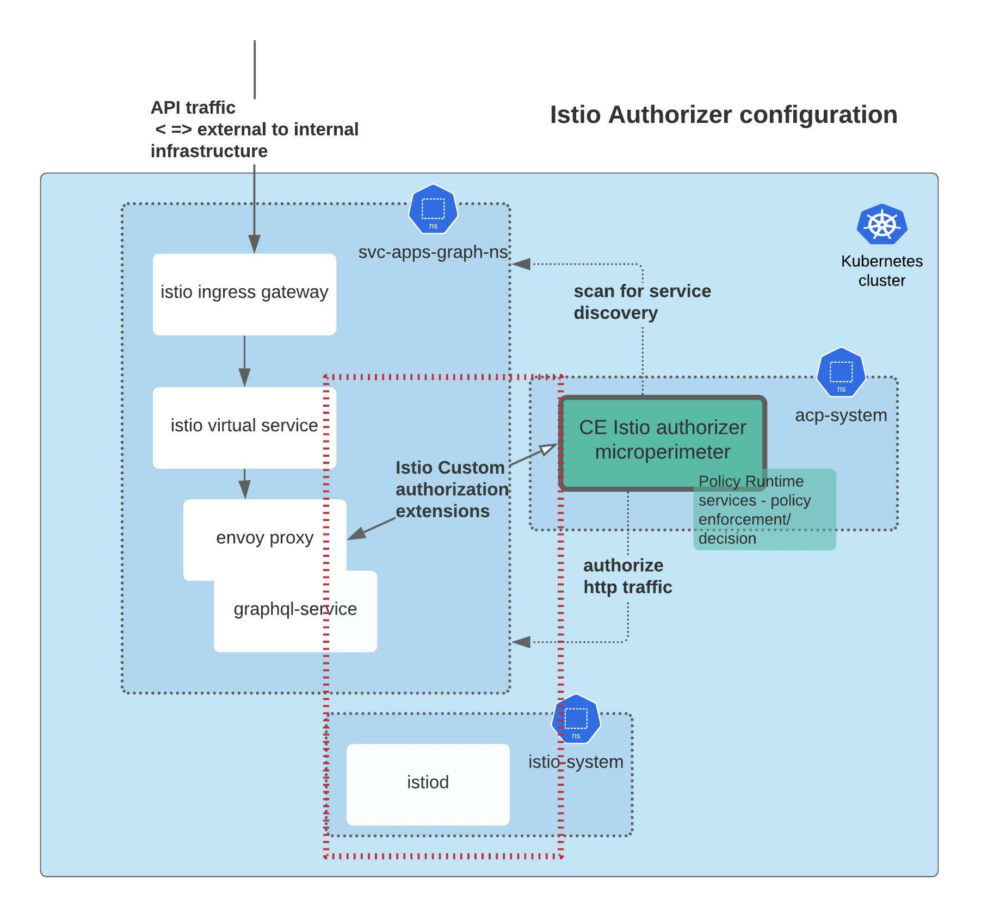

Edit the `istio config map` to define the external Cloudentity Istio authorizer.

```bash
kubectl edit configmap istio -n istio-system
```
Add `extensionProviders` under `mesh` section to indicate that `acp-authorizer` will be an external authz provider.

```yaml
data:
  mesh: |-
    extensionProviders:
    - name: "acp-authorizer"
      envoyExtAuthzGrpc:
        service: "istio-authorizer.acp-system.svc.cluster.local"
        port: "9001"
```

 Final Sample config

```yaml
apiVersion: v1
data:
  mesh: |-
    defaultConfig:
      discoveryAddress: istiod.istio-system.svc:15012
      tracing:
        zipkin:
          address: zipkin.istio-system:9411
    extensionProviders:
    - name: "acp-authorizer"
      envoyExtAuthzGrpc:
        service: "istio-authorizer.acp-system.svc.cluster.local"
        port: "9001"
    enablePrometheusMerge: true
    rootNamespace: istio-system
    trustDomain: cluster.local
  meshNetworks: 'networks: {}'
kind: ConfigMap
metadata:
  creationTimestamp: "2022-01-11T20:02:58Z"
  labels:
    install.operator.istio.io/owning-resource: unknown
    istio.io/rev: default
    operator.istio.io/component: Pilot
    release: istiod
  managedFields:
  - apiVersion: v1
    fieldsType: FieldsV1
    fieldsV1:
      f:data:
        .: {}
        f:mesh: {}
        f:meshNetworks: {}
      f:metadata:
        f:labels:
          .: {}
          f:install.operator.istio.io/owning-resource: {}
          f:istio.io/rev: {}
          f:operator.istio.io/component: {}
          f:release: {}
    manager: Go-http-client
    operation: Update
    time: "2022-01-11T20:02:58Z"
  name: istio
  namespace: istio-system
  resourceVersion: "5345"
  selfLink: /api/v1/namespaces/istio-system/configmaps/istio
  uid: d0201eb4-bf46-4322-bb6c-1dd0c045c348
```

Restart `istiod` for the **external authorizer defintion** to be picked up

```bash
kubectl rollout restart deployment/istiod -n istio-system
```

### Enable Cloudentity external authorization

Now that the external authorizer is defined and let's define and attach the [Istio external authorization policy](https://istio.io/latest/docs/concepts/security/#implicit-enablement).  
External authorization policies are "CUSTOM" actions and will be evaluated first in the Istio authorization policy authorizer.

```bash
kubectl apply -f istio-configs/istio-mp-authorizer-policy.yaml
```

At this point, all the platform components are installed and configured and we should
be able to apply externalized authorization policies in Cloudentity authorization platform and
see the policy decision and enforcement at runtime being done by the `Cloudentity Istio authorizers`
 running in a local Kubernetes cluster.

### Restart the service pods

Since we are using automatic istio injection, we need to recreate the pod, so that `envoy-proxy` is injected

```
kubectl rollout restart deployment/svc-apps-graphql-tweet-service-graphql-nodejs -n svc-apps-graph-ns
```

## Enforce externalized dynamic authorization

Before we start enforcing policies, run the postman collection(https://www.getpostman.com/collections/b84dcc2e6d7034c02d48)
to check if all the GraphQL API operations are still accessible. Once the pre check is complete, let's try to add more authorization scenarios to enforce access and
authorization policies authored and managed via the Cloudentity authorization platform.

For policy governance, we expect the admin (policy administrator) to
* Login into the Cloudentity Authorization portal
* Navigate to the workspace and select `Enforcement >> APIs` nav item to see the GraphQL APIs
* Apply policies at various GraphQL construct level in the GraphQL API explorer

### Scenario#1: Block GraphQL endpoint alltogether

Let's say we want to temporarily block access to all users for this endpoint. For this
* Select the GraphQL API endpoint and attach  a `Block API` policy.

This in effect blocks any call made to any GraphQL operation. Run any of the test
in the [imported Postman Test collection](https://www.getpostman.com/collections/b84dcc2e6d7034c02d48)
and we should see an "authorization denied" response.


| Authorization policy | Output |
| --- | ----------- |
| 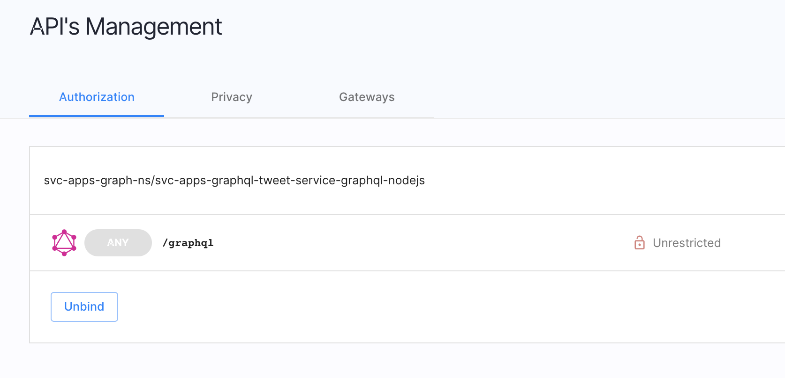 |   |
| 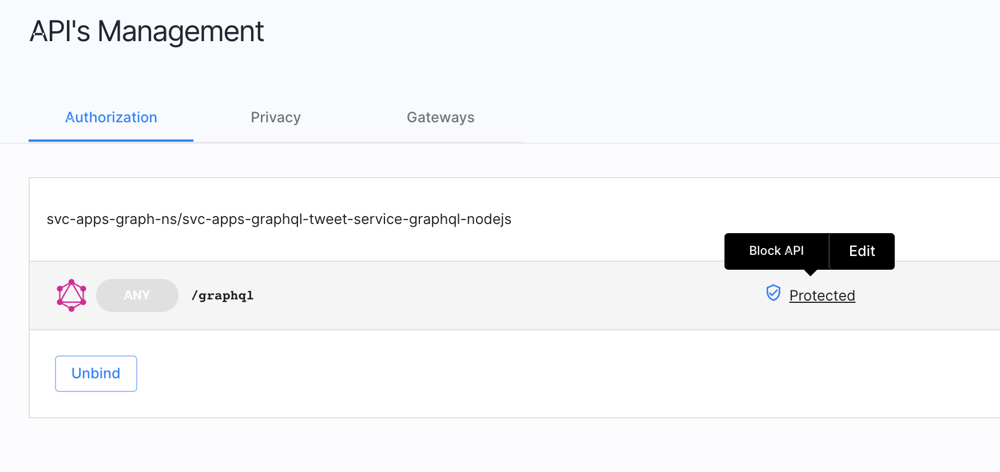 | 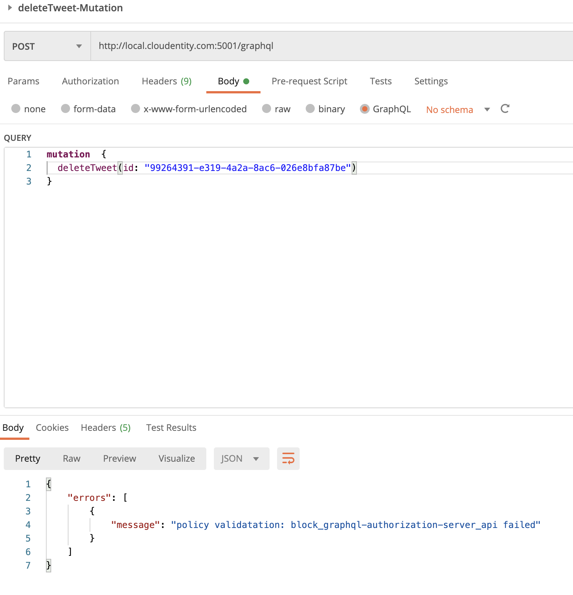 |


### Scenario#2: Disallow GraphQL queries for specific fields

Let's say we do not want GraphQL clients to ask for specific field that is available in the schema. These could be internal
 identifiers or only could be requested by some special priviliged internal applications.For this
* Select the GraphQL API endpoint and enter into the `GraphQL API explorer`
* Navigate to `Objects` and go to the `Tweet` field.
* Assign the `Block API` policy to `dateModified` completely.

This in effect blocks any `GraphQL query` that requests for the `dateModified` field. Let's run the `getLatestTweets`
query from the [imported Postman Test collection](https://www.getpostman.com/collections/b84dcc2e6d7034c02d48).

Modify the request payload to include/exclude `dateModified` in the query and observe the response difference.
Whenever `dateModified` is requested, the request is automatically rejected.

| Authorization policy | Output |
| --- | ----------- |
|  |  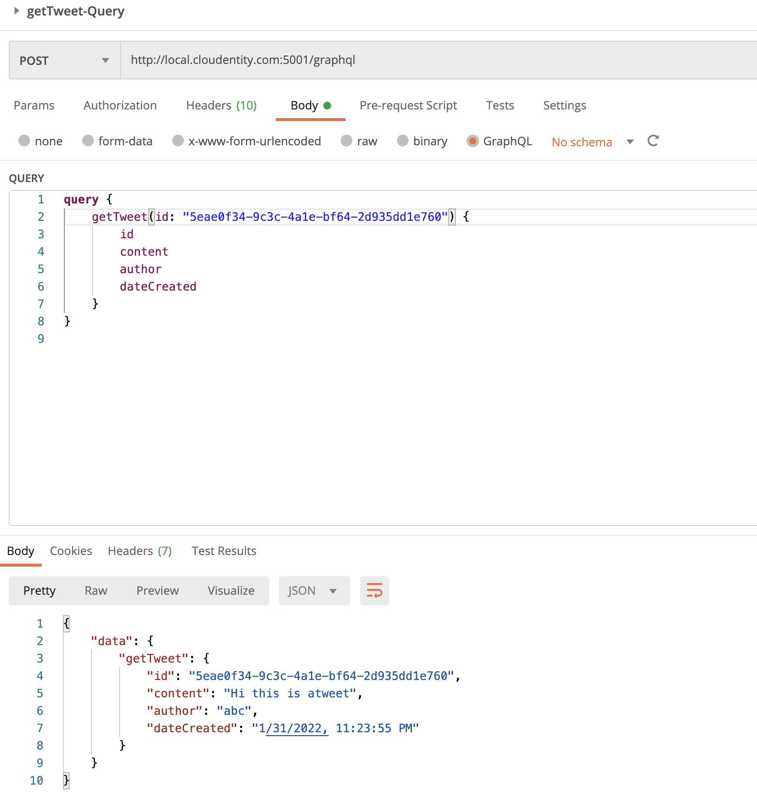 |
|  |  |


### Scenario#3: Disallow GraphQL queries for specific objects with constraints

Let's say we do not want GraphQL clients to ask for specific object unless some specific constraints are met for that
client application. For example, we want to return the `Tweet` object only when some `constraint` is met.
In this  we can apply a policy at the object level
for IP address check that is available in the given range. For this we will use the inbuilt `Rego` engine to author
the policy.

For this:
* Select the GraphQL API endpoint and enter into the `GraphQL API explorer`
* Navigate to `Objects`
* Select the `Tweet` object and apply the constrained `IP check` policy at object level.

`Sample Rego policy`
```yaml
package acp.authz

default allow = false

allowedCidrRange :=   
    [
    "3.0.0.0/9",
    "3.128.0.0/10",
    "4.0.0.0/8",
    "5.8.63.0/32",
    "5.10.64.160/29",
    "217.161.27.0/25"
    ]

extracted_ip := input.request.headers["X-Custom-User-IP"][_]   


is_within_allowed_cidr = true {
    some i
    net.cidr_contains(allowedCidrRange[i], extracted_ip)
} else = false

allow {
  is_within_allowed_cidr
}

```

| Authorization policy | Output |
| --- | ----------- |
|  |  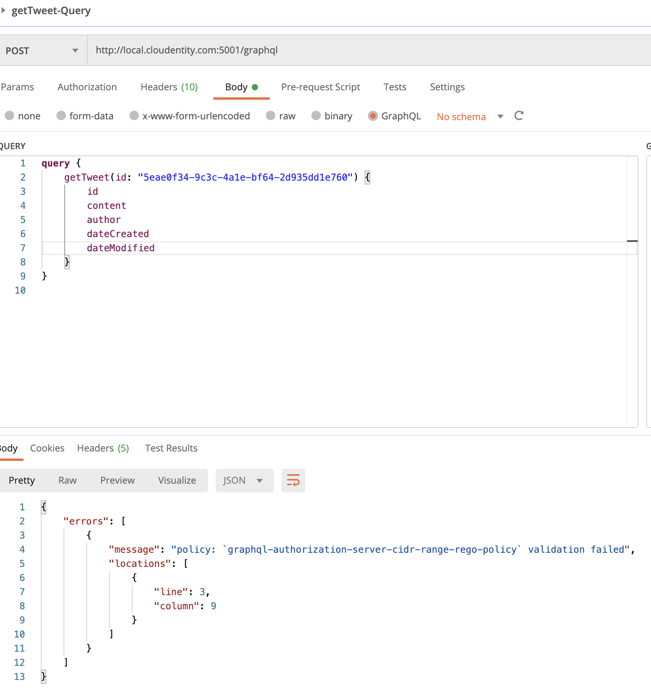 |


### Scenario#4: Block GraphQL delete mutation unless it comes from a client with specific metadata

Let's say we do not want all GraphQL clients to operate on `deleteTweet` mutation.
For example, we want to allow only accessTokens issued to specific clients to be authorized to use the
`deleteTweet` mutation. This way this operation can be used by specific clients and not all client apps even
though it is available in schema.

For this:
* Select the GraphQL API endpoint and enter into the `GraphQL API explorer`
* Navigate to `Mutation`
* Select the `deleteTweet` Mutation operation and apply the constrained `allow-only-for-specific-clients` policy at mutation level.


| Authorization policy | Output |
| --- | ----------- |
|  |   |


### Scenario#5: Allow GraphQL query only if token is issued by a specific Authorization server

Let's say we do not want all GraphQL clients to operate on `getTweets` query.

For example, we want to allow only accessTokens issued by specific authorization servers to be authorized to use the

`getTweets` query.

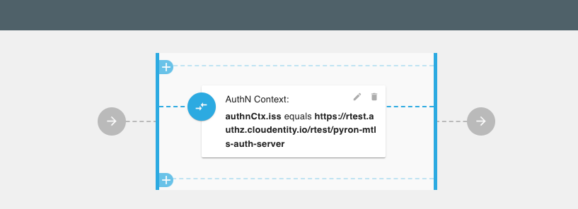

| Authorization policy | Output |
| --- | ----------- |
|  |   |


## Next steps

Now that we have protected a GraphQL API resource server with dynamic and flexible authorization policies, we will build
a simple GraphQL client application to demonstrate an entire application in real life. In this client application, we will
look at how to get an accessToken from the Cloudentity authorization server and then utilize it to make further calls
to GraphQL API resource server.
